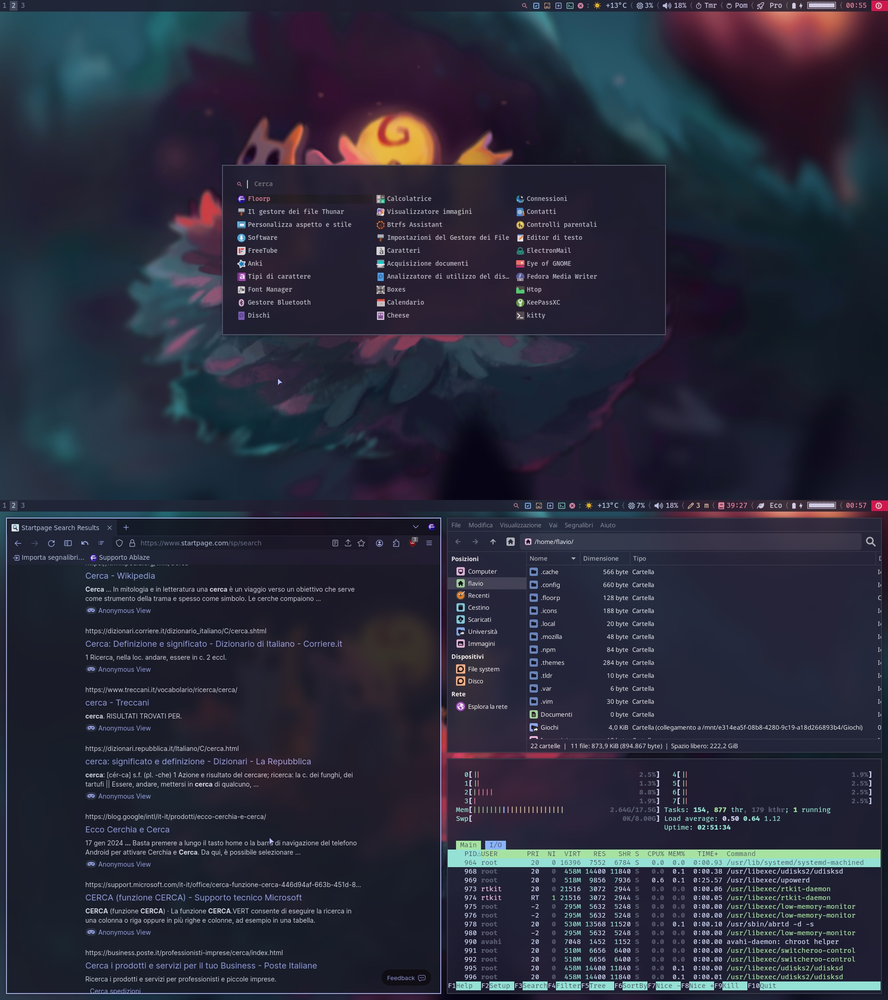

# Cattendeavour

## Setup:

**EndeavourOs i3** is the base of my setup (or just install i3-blocks, feh, maim, scrot, rofi, nm-applet, power-profiles-daemon)
* Install [FiraCode Nerd Fonts](https://www.nerdfonts.com/font-downloads)
* Make all files on i3/scripts , i3/scripts/miei && rofi/rofitodo.sh executable (chmod +x [file])
* To make wallpaper button work: move wallpaper folder to **~/.config/**
* **I created a timer** (for i3blocks): use scroll weel to change => left click to start => left to stop
* gtk theme [Catppuccin](https://aur.archlinux.org/packages/catppuccin-gtk-theme-mocha)
* [icons](https://github.com/ljmill/catppuccin-icons)
* use Thunar for file ; floorp for web. 
* [cursor](https://github.com/catppuccin/cursors) pick on release  " Catppuccin-Mocha-Lavender-Cursors.zip " 
