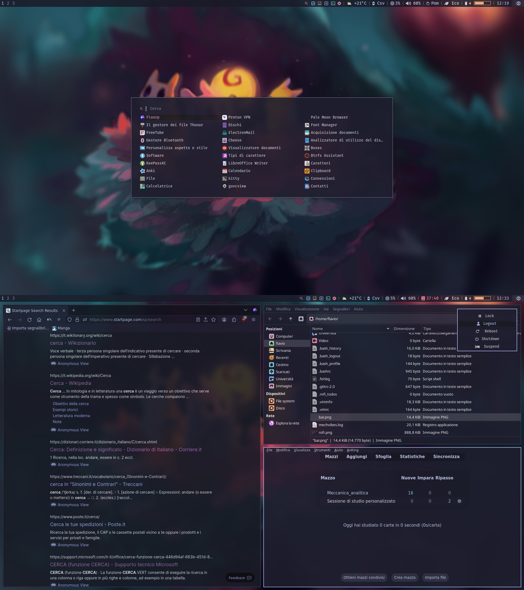

# Cattendeavour

## Setup:

**EndeavourOs i3** is the base of my setup (or install i3-blocks, feh, maim, scrot, rofi, power-profiles-daemon,pulseaudio,networkmanager, blueman)
* Install [FiraCode Nerd Fonts](https://www.nerdfonts.com/font-downloads), **pacman -S ttf-firacode-nerd**
* Make all files on i3/scripts , i3/scripts/miei, rofi/rofitodo.sh executable (chmod +x [file])
* Click wallpaper icon on bar. To make wallpaper button work: move wallpaper folder to **~/.config/**
* Timer (for i3blocks): right click pomodoro, use scroll weel to change => left click to start => left to stop
* gtk theme [Catppuccin](https://aur.archlinux.org/packages/catppuccin-gtk-theme-mocha)
* [icons](https://github.com/ljmill/catppuccin-icons)
* use Thunar for file, firefox for web. 
* [cursor](https://github.com/catppuccin/cursors) pick on release  " Catppuccin-Mocha-Lavender-Cursors.zip " 
## News:

new
* energia_3mode.sh script for all powerprofilesctl
* a fedora update module

old
* Volume icon more interactive (right click for pavcontroll)
* Brightness from 0-100%
* I tried moving to swayfx but nm-applet not work
