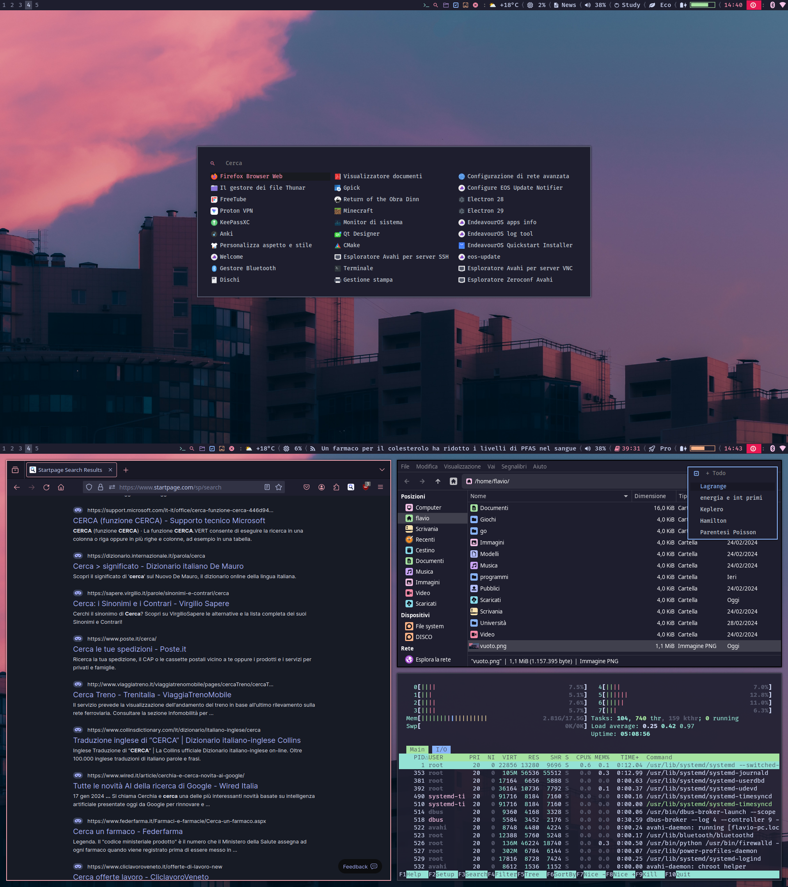

# Cattendeavour

## Setup:
**EndeavourOs i3** is the base of my setup
* To make wallpaper button work: move wallpaper folder to **~/.config/**
* To use the timer: use scroll weel to change => left click to start => left to stop
* Install [FiraCode Nerd Fonts](https://www.nerdfonts.com/font-downloads)
* gtk theme [Catppuccin](https://aur.archlinux.org/packages/catppuccin-gtk-theme-mocha)
* Install rofi-todo

sorry for italian names...
